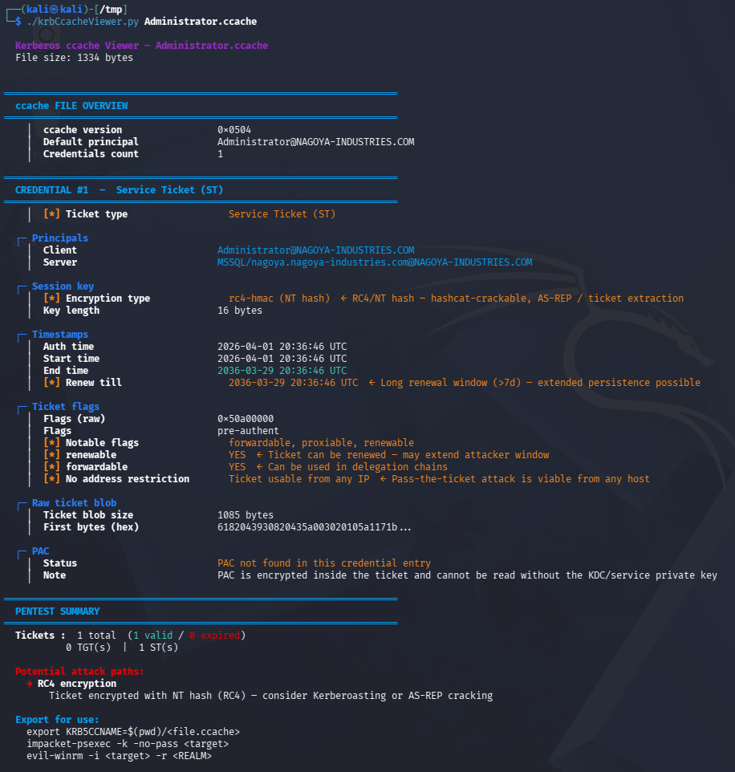

# krbCcacheViewer

A Kerberos `.ccache` ticket analyzer designed for offensive security and pentesting.

This tool parses Kerberos credential cache files (such as those generated by Impacket) and displays their content in a clear, human-readable format, highlighting security-relevant information.

---

## 📸 Example Output

<p align="center">
  
</p>

---

## 🔍 Features

* Parse MIT Kerberos `.ccache` files
* Identify ticket types (TGT / Service Ticket / Cross-realm)
* Decode ticket flags and highlight risky configurations
* Extract and analyze PAC (Privilege Attribute Certificate)
* Identify:

  * Privileged accounts (e.g. Domain Admins)
  * Weak encryption types (DES, RC4)
  * Delegation-related flags
* Display ticket validity and timestamps
* Provide **pentest-oriented insights and attack paths**

---

## 🛠️ Requirements

* Python 3
* No external dependencies (standard library only)

---

## 🚀 Usage

```bash
python3 krbCcacheViewer.py <ticket.ccache>
```

### Example:

```bash
python3 krbCcacheViewer.py Administrator.ccache
```

---

## 🧠 What this tool is for

This tool is designed for:

* Red team operations
* Active Directory assessments
* Kerberos ticket analysis
* Post-exploitation workflows

It helps quickly answer questions like:

* Is this ticket usable for lateral movement?
* Is the account privileged?
* Can this ticket be reused (Pass-the-Ticket)?
* Are there weaknesses (RC4, delegation, etc.)?

---

## 🔐 Security Insights

The tool highlights:

* Weak encryption (DES / RC4)
* Delegation risks (`forwardable`, `ok-as-delegate`)
* Long-lived or renewable tickets
* Privileged group memberships
* Potential attack paths (PtT, S4U, Kerberoasting…)

---

## ⚔️ Example Attack Paths Detected

* Pass-the-Ticket (TGT reuse)
* S4U2Self / S4U2Proxy abuse
* Silver Ticket opportunities
* Offline cracking of weak encryption

---

## 📚 References

* RFC 4120 – Kerberos V5
* MIT Kerberos ccache format
* MS-PAC specification

---

## 📄 License

This project is licensed under the GNU GPL v3 License.

---

## 👤 Author

**johnkravicz**

---

## ⚠️ Disclaimer

This tool is intended for educational and authorized security testing purposes only.
Do not use it on systems you do not own or have explicit permission to test.

This script is generated using AI : it may bug, crash, invite aliens or even cause apocalypse. 
Please use with caution.